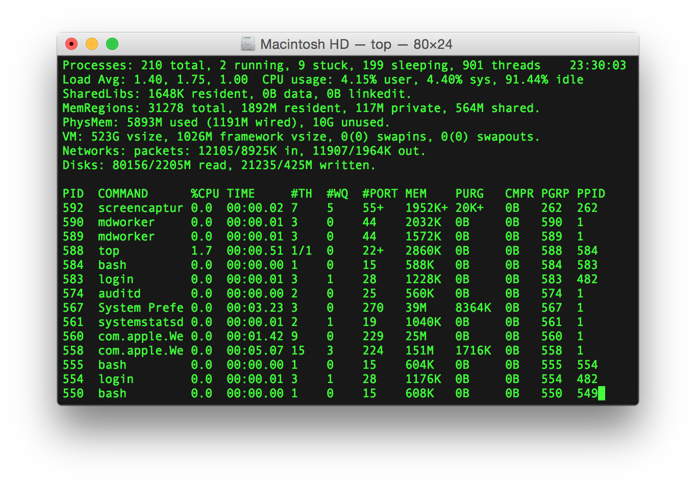
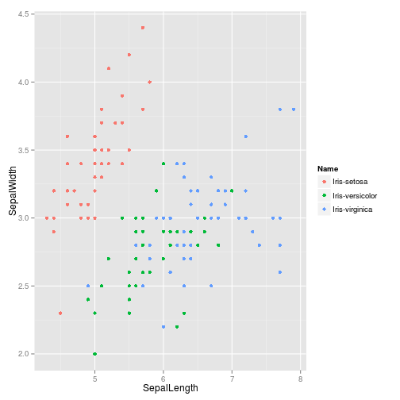
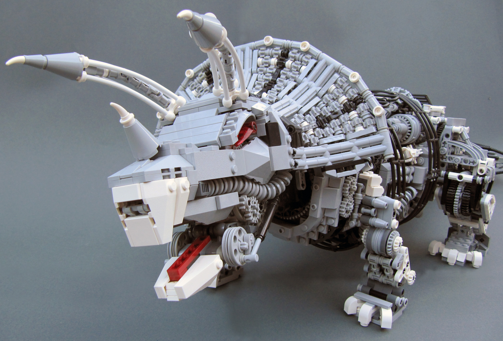
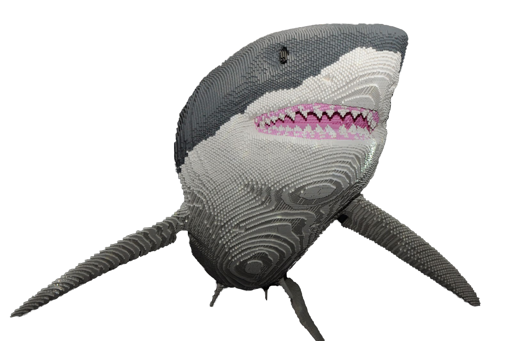
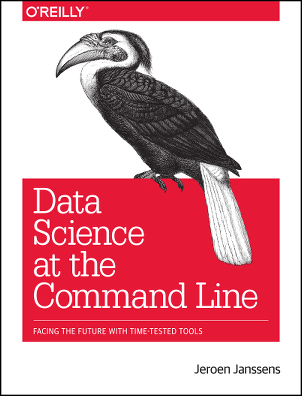

# Introduction

## Always Start with a Bad Comparison

\centering
Graphical User Interface (GUI)

vs.

Command Line Interface (CLI)

---

## The GUI is a Panda

- Pros
    - cute
    - cuddly
- Cons
    - poops a lot
    - difficult to breed in captivity

---

## The Command Line is a Shark

- Cons
    - scary
    - sharp edges
- Pros
    - efficient
    - found everywhere
    - evolved over many years to be perfect at what it does

# Concepts

## Evolution

To really understand the command line, think about its evolution.

---

---

---

---

---

## Streams of Text

All these machines have a purpose in common.

\pause

They are for **two-way communication** using **streams of text**.

\pause

- You can **communicate** with a person or a program
- Anything that can be written as **text** can be communicated
- Text **flows** back and forth in **streams**

# The Basics

## Terminal

The terminal is the machine that accepts input from a user, sends it, accepts a response, and displays it to the user.

## Shell

The shell is an interactive program that uses the terminal to provide a command line interface with a computer.

\pause

Examples:

- Bourne Shell (sh)
- Bourne Again Shell (bash)
- Z Shell (zsh)

## The Command Prompt

The command prompt is your endpoint in the communication.

The shell listens for your commands, sends them off to a program, waits for a reply, and prints the reply to the display.

## The Command Prompt

## The Command Prompt

You can customize your command prompt. It might contain your username, the name of the machine, and the current directory, like this:

    vagrant@data-science-toolbox:~$

The most basic prompt is just a dollar sign, and that's what's used in most examples:

    $

## Follow Along at Home

Different operating systems have different terminals, shells, and programs. Fortunately, it's pretty easy to run a copy of the same *virtual machine* on any current operating system.

## Data Science Toolkit

Jeroen Janssens has created the **Data Science Toolbox** to go with his great book [*Data Science at the Command Line*](http://datascienceatthecommandline.com). Install the [Data Science Toolbox](http://datascienceatthecommandline.com/#dst), following steps 1 to 4, and then you can follow along with this presentation.

This requires about 1.5GB of downloads, but can be reused for many projects. Virtual machines are great.

## Data Science Toolkit

1. Download and install [VirtualBox](https://www.virtualbox.org/wiki/Downloads)

2. Download and install [Vagrant](http://www.vagrantup.com/downloads.html)

3. Download and start the Data Science Toolbox: open a terminal and run these commands

\scriptsize

        $ mkdir MyDataScienceToolbox
        $ cd MyDataScienceToolbox
        $ vagrant init data-science-toolbox/data-science-at-the-command-line
        $ vagrant up
\normalsize

4. Log in to the virtual machine

\scriptsize

        $ vagrant ssh
        vagrant@data-science-toolbox:~$

## Data Science Toolkit

When you're done, you can exit the virtual machine and delete it:
\scriptsize

    vagrant@data-science-toolbox:~$ exit
    $ vagrant destroy
      default: Are you sure you want to destroy the 'default' VM? [y/N] y

## What Did You Say?

Imagine sitting at a teleprinter.

\pause

You see the command prompt on the paper:

    $

\pause

You bang on the keys:

    $ echo Hello world!

\pause

You hit `return` and the paper advances one line.

## What Did You Say?

Electrons fly over wires to a mainframe in the next room.

\pause

Electrons fly back!

\pause

The teleprinter starts chattering, banging out a reply on the paper, one character at a time:

\pause

    Hello world!

\pause

The future is here!

## cowsay

Slightly more amusing than `echo`, try

    $ cowsay Mooooo!

\pause

You should see something like:

     _________
    < Mooooo! >
     ---------
            \   ^__^
             \  (oo)\_______
                (__)\       )\/\
                    ||----w |
                    ||     ||

## Moving Around

The `cd` command is used to move to different directories. Your command prompt might include the current directory.

Note that `~` is short for your "home" directory on a Unix machine, and `..` means the "parent" directory.

    vagrant@data-science-toolbox:~$ cd book
    vagrant@data-science-toolbox:~/book$ cd ..
    vagrant@data-science-toolbox:~$

## Looking Around

You can see what's in a directory using `ls` ("list"). There are several options:
\small

    $ ls
    book  get-pip.py

\pause

    $ ls -a
    .                 book
    ..                .cache
    .ansible          .data-science-at-the-command-line
    .bash_aliases     .drip-repo
    .bash_completion  get-pip.py
    .bash_history     .go
    .bash_logout      .profile
    .bashrc           .ssh
    .bin              .vbox_version

## Looking Inside

The `cat` command concatenates files, but it's also useful for just displaying the contents of a file:
\small

    $ cat /etc/hosts
    127.0.0.1       localhost
    127.0.1.1       data-science-toolbox

    # The following lines are desirable for IPv6 capable hosts
    ::1     localhost ip6-localhost ip6-loopback
    ff02::1 ip6-allnodes
    ff02::2 ip6-allrouters

## Downloading Files

Let's download a dictionary file to use in our examples.

\small

    $ curl -O http://www.puzzlers.org/pub/wordlists/ospd.txt
    $ ls
    book  get-pip.py  ospd.txt

## heads and tails

There are commands for displaying just the first lines of a file:

    $ head ospd.txt
    aa
    aah
    aahed
    aahing
    aahs
    aal
    aalii
    aaliis
    aals
    aardvark

## heads and tails

...or the last lines of a file:

    $ tail ospd.txt
    zymogram
    zymology
    zymosan
    zymosans
    zymoses
    zymosis
    zymotic
    zymurgy
    zyzzyva
    zyzzyvas

## Counting Stuff

There are many other useful commands. Count the lines in a file:

    $ wc --lines ospd.txt
    79339 ospd.txt

\pause

Command names are often short, but usually form a kind of sentence that helps you remember.

Read this one as "word count lines in ospd.txt".

## Finding Stuff

Find lines with a particular sequence of characters:

    $ grep aar ospd.txt
    aardvark
    aardwolf
    aargh
    aarrgh
    aarrghh
    bazaar
    bazaars
    haar
    haars
    maar
    maars

## And so much more!

The web page for [*Data Science at the Command Line*](http://datascienceatthecommandline.com/#tools) lists many more useful command line tools, with examples.

There's a lot more to learn, but let's stay focused on the big picture.

# The Not-So-Basics

## Anatomy of a Command

Commands consist of the name of a program followed by zero or more options and arguments.

Some options may have defaults that you can override. Sometimes a command will read configuration from a file. These are powerful tools, and things can get complicated.

## Line Breaks

The `\` character at the end of a line indicates that a command continues on the next line, e.g.

    pandoc metadata.yaml command-line.md \
      --from markdown \
      --to beamer \
      --slide-level 2 \
      --standalone \
      --include-in-header include.tex \
      --output command-line.pdf

## Option Flags

Option flags tell the program to change the way it operates.

Short option flags:

- begin a single hyphen, e.g. `ls -a`
- can be "stacked", so these are the same
    - `ls -lah`
    - `ls -l -a -h`
- upper case and lower case
- concise but cryptic

## Option Flags

Long option flags:

- start with two hyphens, e.g.
    - `ls --all`
    - `ls --human-readable`
- usually lower case
- easier to read, take up more space

## Common Option Flags

- `-h` or `--help`
- `-V` or `--version`
- `-q` or `--quiet`
- `-v` or `--verbose`
- `-r` or `--recursive`
- `-f` or `--force`

## Arguments, Options, and Parameters

Some options also take a parameter. Sometimes the option and its parameter are separated by an `=` sign, sometimes separated by a space. Options usually come before non-option arguments, but can often come after.

\pause
\small

    $ ls -l --color=never book/
    total 36
    drwxr-xr-x 3 vagrant vagrant 4096 Sep 30  2014 ch01
    drwxr-xr-x 3 vagrant vagrant 4096 Sep 30  2014 ch02
    drwxr-xr-x 3 vagrant vagrant 4096 Sep 30  2014 ch03
    drwxr-xr-x 3 vagrant vagrant 4096 Sep 30  2014 ch04
    drwxr-xr-x 3 vagrant vagrant 4096 Sep 30  2014 ch05
    drwxr-xr-x 3 vagrant vagrant 4096 Sep 30  2014 ch06
    drwxr-xr-x 3 vagrant vagrant 4096 Sep 30  2014 ch07
    drwxr-xr-x 3 vagrant vagrant 4096 Sep 30  2014 ch08
    drwxr-xr-x 3 vagrant vagrant 4096 Sep 30  2014 ch09

## Read the Fine Manual

Every command line program does something different, and so it has different options and arguments.

Sometimes there's a **lot** of options available.

You can always find out more using the `--help` option, or reading the fine manual:

    $ ls --help
    $ man ls

Or Google it!

## Quoting

If an argument or parameter contains spaces, you should wrap it with single or double quotation marks. Otherwise the shell will think that you're sending more than one parameter or argument to the program.

    $ echo "Double quotation marks"
    Double quotation marks

## Escaping

Sometimes you need to use quotation marks inside quotation marks, or other trick combinations. The `\` character is used for "escaping" the following character. Admittedly, this can get ugly.

    $ echo "You can \"escape\" quotes"
    You can "escape" quotes

## The Environment

The shell defines many useful variables in its "environment", and you can define your own.

The `PATH` variable holds a list of directories used to find programs:

    $ echo $PATH
    /usr/local/sbin:/usr/local/bin:/usr/sbin:/usr/bin:
    /sbin:/bin:/usr/games:/usr/local/games:/home/vagra
    nt/tools:/usr/lib/go/bin:/home/vagrant/.go/bin:/ho
    me/vagrant/.data-science-at-the-command-line/tools
    :/home/vagrant/.bin

## The Environment

You read a variable using `$` and its name.

You set a variable using `export`.

    $ export FOO=BAR
    $ echo $FOO
    BAR

# Composition

## Streams of Text

So far, all our streams of text have had a simple flow:

## Three Streams

Actually, there are **three streams** in the basic case:

- STDIN: accepts input
- STDOUT: sends output about normal operations
- STDERR: sends output about errors and exceptions

STDERR is usually merged into STDOUT, so I won't always make the distinction. But you can keep them separate if you want to.

## Three Streams

## Output can be Input

All of our commands take text as input and send text as output.\pause

\centering

**It's all just text!**

\flushleft
\pause

The program doesn't care\pause

- whether the input text came from us or another program\pause
- whether it sends the output text to us or another program\pause

The **output** of one program can be the **input** to another.

## Output can be Input

## Output can be Input

This works because **text is the universal interface**.

\pause

Let's see the GUI do that!

## Simple Pipes

The "pipe" `|` is used to connect output to input. Think of text flowing through a pipeline of commands:

How many words contain "aar"?

    $ grep aar ospd.txt | wc --lines
    11

## Simple Pipes

The first 10 words that start with "ba":

    $ grep ^ba ospd.txt | head
    ba
    baa
    baaed
    baaing
    baal
    baalim
    baalism
    baalisms
    baals
    baas

## Redirect Input from File

The `<` character is used to redirect input, usually reading from a file:

    $ grep aar ospd.txt | wc --lines
    11
    $ < ospd.txt grep aar | wc --lines
    11

\pause

Order of redirects and pipes is somewhat flexible

    $ grep aar < ospd.txt | wc --lines
    11

but this doesn't work correctly:

    $ grep aar | wc --lines < ospd.txt
    79339

## Redirect Output to File

The `>` character is used to redirect output to a file:

    $ < ospd.txt grep aar | wc --lines > count.txt
    $ cat count.txt
    11

If that file already exists, it is replaced.

## Append Output to File

We use `>>` to append content to a file.

    $ grep aard < ospd.txt > words.txt
    $ cat words.txt
    aardvark
    aardwolf

\pause

    $ grep aarg < ospd.txt >> words.txt
    $ cat words.txt
    aardvark
    aardwolf
    aargh

## (Almost) Everything is a Stream of Text

- terminal input
- terminal output
- error messages from programs
- files: text, code, tables, XML, JSON
- network: HTTP, FTP, UDP, TCP
- logs
- devices

## Tables are Streams of Text

Almost all the data you want to work with can be represented as a stream of text.

Tables are just lines (rows) of text where columns are separated by spaces, tabs, commas, etc.

Unix tools are great with tables!

## Tables are Streams of Text

\small

    $ ls -l *.txt
    -rw-rw-r-- 1 vagrant vagrant      3 Dec  9 14:53 count.txt
    -rw-rw-r-- 1 vagrant vagrant 614670 Dec  9 14:53 ospd.txt
    -rw-rw-r-- 1 vagrant vagrant     24 Dec  9 14:36 words.txt

\pause

    $ ls -l *.txt | awk 'BEGIN{print "Name,Size"} {print $9 "," $5}'
    Name,Size
    count.txt,3
    ospd.txt,614670
    words.txt,24

## Visualizing Data with R and ggplot2

More cool stuff from Jeroen Janssens: [Rio](http://jeroenjanssens.com/2013/09/19/seven-command-line-tools-for-data-science.html) makes it easy to send data to R and ggplot2.

\scriptsize

    $ < book/.data/iris.csv \
    Rio -ge \
    'g+geom_point(aes(x=sepal_length,y=sepal_width,colour=species))' \
    > iris.png

## Visualizing Data with R and ggplot2

## Python Scripts in Pipes

It's also very easy to make a Python script work with STDIN and STDOUT. Write this script in `upper.py`.

    #!/usr/bin/env python
    import fileinput

    for line in fileinput.input():
      print(line.upper())

## Python Scripts in Pipes

Then make it executable:

    $ chmod +x upper.py

and run it:

    $ echo 'foo bar' | ./upper.py
    FOO BAR

## Pipes are Smart

Streams can contain many lines of text. They can even be infinitely long!

But pipes are smart. Lines are processed one-at-a-time. When one of the commands finishes, the pipeline stops.

## Pipes are Smart

So it's efficient to do things like read the first three lines of a stream with one hundred billion lines:

    $ seq 3
    1
    2
    3
    $ seq 100000000000 | head -n3
    1
    2
    3

## Commands for Building Commands

\centering

**Commands are also just text!**

\flushleft
\pause

There are also commands that take STDIN and run more commands.

## Commands for Building Commands

    $ < ospd.txt grep aard | xargs -n1 echo WORD:
    WORD: aardvark
    WORD: aardwolf

The `xargs` command takes lines from `grep`, appends each one to

    echo WORD:

and runs each result as a new command.

## Shell Scripts

You can do amazing things with pipes!

\pause

But as they get longer, you don't want to be typing them over an over.

\pause

So write your command in a script file called `count.sh`:

    #!/bin/bash
    < ospd.txt \
    grep aar \
    | wc --lines

## Shell Scripts

Then make `count.sh` executable:

    $ chmod +x count.sh

and run it:

    $ ./count.sh
    11

## Make

Even more powerful than a shell script is Make.

You tell Make which commands are required to create which files, and which files each command depends upon.

Then Make can figure out which commands must be run to update which files.

## Make

This is a simple `Makefile`:

\small

    ospd.txt:
    	curl -O http://www.puzzlers.org/pub/wordlists/ospd.txt

    count.txt: ospd.txt
    	< ospd.txt \
    	grep aar \
    	| wc --lines \
    	> count.txt

## Sharp Edge!

Warning: `Makefile`s use tabs before commands. Make sure that your text editor displays tabs distinct from spaces.

## Make

If `count.txt` is newer than `ospd.txt`, then `make` does nothing.

    $ make count.txt
    make: `count.txt' is up to date.
    $ cat count.txt
    11

## Make

If we delete `ospd.txt`, `make` knows to download that file first, then it updates `count.txt`:

    $ rm ospd.txt
    $ make count.txt
    curl -O http://www.puzzlers.org/pub/wordlists/ospd.txt
    < ospd.txt \
            grep aar \
            | wc --lines \
            > count.txt
    $ cat count.txt
    11

## Make

Make brings together all the power of the command line to create complex, repeatable workflows.\pause

Store your input data and `Makefile` in version control, then generate result files as needed.\pause

I use Make for all sorts of things, even building the PDF for this presentation.

# Conclusion

## Always Close with a Summary

\centering
Graphical User Interface (GUI)

vs.

Command Line Interface (CLI)

## The GUI is an Action Figure

## The GUI is an Action Figure

It looks cool, but you can only move it in the ways it was designed to move.

## The CLI is LEGO

## The CLI is LEGO

Not always as pretty, but it's been around forever, it still works great, and the only limit is your imagination.

## I Guess What I'm Saying Is...

\pause

## Learn More

## Photo Credits

"<a href="https://commons.wikimedia.org/wiki/File:Panda_Cub_from_Wolong,_Sichuan,_China.JPG#/media/File:Panda_Cub_from_Wolong,_Sichuan,_China.JPG">Panda Cub from Wolong, Sichuan, China</a>" by <a href="//en.wikipedia.org/wiki/User:Sheilalau" class="extiw" title="wikipedia:User:Sheilalau">Sheilalau</a> at <a href="//en.wikipedia.org/wiki/" class="extiw" title="wikipedia:">English Wikipedia</a> - Transferred from&nbsp;<a class="external text" href="http://en.wikipedia.org">en.wikipedia</a>&nbsp;to Commons.. Licensed under Public Domain via <a href="//commons.wikimedia.org/wiki/">Wikimedia Commons</a>.

"<a href="https://commons.wikimedia.org/wiki/File:White_shark_(Carcharodon_carcharias)_scavenging_on_whale_carcass_-_journal.pone.0060797.g004-A.png#/media/File:White_shark_(Carcharodon_carcharias)_scavenging_on_whale_carcass_-_journal.pone.0060797.g004-A.png">White shark (Carcharodon carcharias) scavenging on whale carcass - journal.pone.0060797.g004-A</a>" by Fallows C, Gallagher AJ, Hammerschlag N (2013) - Fallows C, Gallagher AJ, Hammerschlag N (2013) White Sharks (Carcharodon carcharias) Scavenging on Whales and Its Potential Role in Further Shaping the Ecology of an Apex Predator. PLoS ONE 8(4): e60797. <a href="//dx.doi.org/10.1371/journal.pone.0060797" class="extiw" title="doi:10.1371/journal.pone.0060797">doi:10.1371/journal.pone.0060797</a>. Licensed under <a href="http://creativecommons.org/licenses/by/2.5" title="Creative Commons Attribution 2.5">CC BY 2.5</a> via <a href="//commons.wikimedia.org/wiki/">Wikimedia Commons</a>.

## Photo Credits

"<a href="https://commons.wikimedia.org/wiki/File:Appleterminal2.png#/media/File:Appleterminal2.png">Appleterminal2</a>" by <a href="//en.wikipedia.org/wiki/User:Gortu" class="extiw" title="wikipedia:User:Gortu">Gortu</a> at <a href="//en.wikipedia.org/wiki/" class="extiw" title="wikipedia:">English Wikipedia</a> - Transferred from&nbsp;<a class="external text" href="http://en.wikipedia.org">en.wikipedia</a>&nbsp;to Commons.. Licensed under Public Domain via <a href="https://commons.wikimedia.org/wiki/">Commons</a>.

"<a href="https://commons.wikimedia.org/wiki/File:DEC_VT100_terminal.jpg#/media/File:DEC_VT100_terminal.jpg">DEC VT100 terminal</a>" by <a href="//www.flickr.com/people/54568729@N00" class="extiw" title="flickruser:54568729@N00">Jason Scott</a> - <a href="//commons.wikimedia.org/wiki/Flickr" title="Flickr" class="mw-redirect">Flickr</a>: <a rel="nofollow" class="external text" href="http://flickr.com/photos/54568729@N00/9636183501">IMG_9976</a>. Licensed under <a href="http://creativecommons.org/licenses/by/2.0" title="Creative Commons Attribution 2.0">CC BY 2.0</a> via <a href="https://commons.wikimedia.org/wiki/">Commons</a>.

"<a href="https://commons.wikimedia.org/wiki/File:ASR-33_at_CHM.agr.jpg#/media/File:ASR-33_at_CHM.agr.jpg">ASR-33 at CHM.agr</a>" by <a href="//commons.wikimedia.org/wiki/User:ArnoldReinhold" title="User:ArnoldReinhold">ArnoldReinhold</a> - Own work. Licensed under <a href="http://creativecommons.org/licenses/by-sa/3.0" title="Creative Commons Attribution-Share Alike 3.0">CC BY-SA 3.0</a> via <a href="https://commons.wikimedia.org/wiki/">Commons</a>.

"<a href="https://commons.wikimedia.org/wiki/File:Bundesarchiv_Bild_183-2008-0516-500,_Fernschreibmaschine_mit_Telefonanschluss.jpg#/media/File:Bundesarchiv_Bild_183-2008-0516-500,_Fernschreibmaschine_mit_Telefonanschluss.jpg">Bundesarchiv Bild 183-2008-0516-500, Fernschreibmaschine mit Telefonanschluss</a>" by Bundesarchiv, Bild 183-2008-0516-500 / CC-BY-SA 3.0. Licensed under <a href="http://creativecommons.org/licenses/by-sa/3.0/de/deed.en" title="Creative Commons Attribution-Share Alike 3.0 de">CC BY-SA 3.0 de</a> via <a href="https://commons.wikimedia.org/wiki/">Commons</a>.

Stock Ticker Patents "[Telegraph, D.E. Hughes, 20 May, 1856 178/35 ; 178/37- spring power](http://www.prc68.com/I/Images/HughesPrintTeleb.jpg)"

## Photo Credits

JPToys.com "[Triceratops With Removable Dino-Damage Wound & Head-Ramming Attack](http://www.jptoys.com/toy-database/jurassic-park/jurassic-park-series-1/dinosaurs/triceratops/index.htm)"

Alyse & Remi "[Pokey](https://www.flickr.com/photos/boltofblue/5941445953)"

Anne Fawcett "[A lego shark at Sydney Aquarium](http://2.bp.blogspot.com/-7j_-BECKnQI/Uvk_gTFAIEI/AAAAAAAACVk/dgWq9eDfmko/s1600/Lego+Shark.jpg)"

